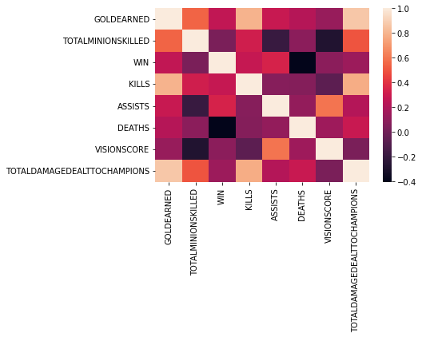

# League of Legends Match Outcome Prediction
This project is being developed as part of the Knowledge Discovery in Databases (ITCS - 6162) course at The University of North Carolina at Charlotte.

## Team Members:
- Tarun Ravada
- Vishwath Kamalanathan
- Swetha Natakala Ramakumar
- Adithi Macherla

## Introduction
League of Legends, commonly referred to as League, is a highly popular Multiplayer online battle arena game by RIOT Games. If this is your first time hearing about League, please visit this [page](https://www.leagueoflegends.com/en-us/how-to-play/) for a quick introduction to the game.

League is currently one of the most played and most viewed games on Twitch, a popular streaming platform. The League of Legends World Championship held annually is one of the largest esports in the world, with a prize pool of more than 2 million USD. The game attracts players and viewers from different regions of the world, with the largest player bases being Europe and North America. 

For a popular game such as League, streamers, professional teams, and team sponsors have high stakes riding on their performance in the game. As such, a lot of time and resources are spent analyzing the game to maximize a teams’ win rate. 

## Project 
### Description
This project aims to identify the factors that can be used to determine the outcome of a match of league and develop a machine learning model that can predict which team out of two will win a match of League, given some initial information about the teams. 

Every match of League has many factors that affect the outcome of the match. Some of these factors such as the playable character (champion) being played, the proficiency of a player with a champion, the role in which a champion is being played, etc., can be determined before a match even begins.

These factors can be captured by different metrics such as overall win rate of a champion, average kills-deaths-assists of a champion, etc.

This project will consider several of these metrics in conjunction with the team composition of the two teams (the champions that each team consists of) and identify the factors that are most useful in predicting the outcome of a match.

### Data
The initial data source for this project is a large data set consisting of in-game statistics of players playing League at the Master rank level. The dataset was obtained from [Kaggle](https://www.kaggle.com/jasperan/league-of-legends-1v1-matchups-results). Additional game data will be obtained from League servers using the Riot Games [API](https://developer.riotgames.com/docs/lol).

To understand the data attributes we utilized information available through the RIOT developers [documentation](https://developer.riotgames.com/docs/lol#general_game-constants) and our knowledge of the game

More information about the data is provided in the [Data Understanding](#data-understanding) section.

### Installation
- Python version >= 3.8
- Jupyter Notebook 

## CRISP-DM Process:
- [Business Understanding](#business-understanding)
- [Data Understanding](#data-understanding)
- [Data Transformation](#data-transformation)
- [Modeling](#modeling)
- [Evaluation](#evaluation)

### Business Understanding
As outlined in the [Introduction](#introduction), for those with high stakes in League, constantly improving their game win rate is important. Being able to determine the chances of winning a match based on the team composition is very valuable to players, as it will help them choose the best possible champion for each match.

Team composition by itself does not provide enough information to determine the outcome of a match. Several other factors such as a players’ proficiency, a champions’ usefulness, etc., play an important role in the outcome of a match.

This project will consider the following metrics along with team composition, as inputs to the predictive model.
- Win rate of the champion in the role being played
- k/da of the champion in the role being played
- Win rate of the champion in the game
- k/da of the champion in the game

Feature Description
- Win rate is the ratio of games won to total games played
- k/da is the ratio of kill+assists to total deaths

More information about these attributes is provided in the [Data Understanding](#data-preprocessing) section.

#### Success Criteria
To be functional, the predictive model should have an accuracy of at least 50%, as that is the probability of winning a random match of League. 
In addition to developing a predictive model, this project will also study the relationship between different game attributes, and identify the ones that impact the outcome of a game the most.

### Data Understanding
#### Data Collection
The initial dataset ‘matches.csv’ was obtained as described in the [Data](#data) section. The dataset had 14 columns and 1312252 records.

The different columns can be separated into 3 categories:

Match attributes - attributes common to every match
 - GOLDEARNED, TOTALMINIONSKILLED, WIN, KILLS, ASSISTS, DEATHS, CHAMPION, VISIONSCORE, TOTALDAMAGEDEALTTOCHAMPIONS

Unique attributes - attributes unique to every match or the game itself
 - P_MATCH_ID, PUUID, SUMMONERNAME, GAMEVERSION

Irrelevant attributes
 - Unnamed: 13

#### Data preprocessing
The original data ‘matches.csv’ contained irrelevant attributes, missing values, and columns with more than one attribute. The data was cleaned, irrelevant attributes were dropped, and null and invalid records were removed. 

#### Data Exploration
Associated Notebooks
- [EDA](EDA.ipynb)

The dataset was explored to understand its range of values and types of values. This helped determine which additional features can be generated from the data to use as inputs to the model.

Each record in the dataset corresponds to one player in a match. The dataset contains information about multiple players from each match.

After processing the dataset contained 1312248 records and 15 columns
- GOLDEARNED - Gold earned by player in the match
- TOTALMINIONSKILLED - Total minions killed by player in the match
- WIN - Match won or lost. Either True or False
- KILLS - Total kills by player in the match
- ASSISTS - Total assists by player in the match
- DEATHS - Total deaths of player in the match
- CHAMPION - The champion being played
- VISIONSCORE - The vision score of the player in the match
- TOTALDAMAGEDEALTTOCHAMPIONS - Total damage dealt by player to other players
- PUUID - The unique identifier of the player. it is tied to the player's RIOT games account, and is unique through the game, across all regions.
- SUMMONERNAME - The "username" / "gamertag" of the player. It is unique within a region.
- GAMEVERSION - The version of the game a match belongs to.
- REGION - Region (US, EU, etc.) in which the match was played. Only players from a single region can queue together.
- MATCH_ID - Unique identifier for each match in the dataset. Each match must have 10 records
- ROLE - The role the player was playing in the match

##### Correlation

Correlation analysis showed that Kills, Assists, and Gold have a stronger correlation with winning than other factors. 

##### Feature Distribution

Feature value distributions were studied to ensure the data had no irregularity or outliers. All the feature distributions were as expected.

##### Class Distribution

The distribution of the class label was plotted across different features. The plots show that the data is almost equally distributed across each class.

##### Champion Data analysis
Our dataset contains information on all the 156 different champions available in-game as of Patch 11.17
 
Champion Winrate

Champion win rate by role

All champion win rates are within the range of 44 to 54 percent. This is expected since the game is constantly balanced so that all champions have a comparable win rate. 

Champion win rates by role are in the range of 0 - 100 percent. This shows that champion win rates by role can be an important factor in determining the outcome of a match.

From EDA we learned that overall champion win rate, champion win rate by role, kills, deaths, and assists are factors that vary the most between winning and losing teams. Since these factors can be represented through metrics available before the start of a game, such metrics could be used to predict the outcome of a match before a match starts. 

### Data Transformation
#### Metric Generation

Associated notebooks
- [Dataset for Champion k/da by role](preprocessing/champ_role_kda.ipynb)

Six new metrics were considered 
- Champion win-rate - The matches won/ total matches ratio of a champion 
- Champion kda - The (total kills + total assists)/total deaths ratio of a champion
- Champion role win-rate - The win rate of a champion in a particular role
- Champion role kda - The kda of a champion in a particular role
- Player role win-rate - The win rate of a player in a role
- Player champion win-rate - The win rate of player on a champion

However, due to a lack of player data metrics could not be generated for Player role win-rate and Player champion win-rate.
Using the matchups dataset metrics datasets were generated for Champion win-rate, Champion kda, Champion role win-rate, and Champion role kda.

Given that League has 156 different champions and 5 different roles, a total of 780 different champion x role combinations are possible. However, not all champions are played in all roles. Using the matchups dataset metrics could be generated for 565 different champ x role combinations.

#### Transformation

Associated notebooks

Associated Notebooks
- [Transformations](preprocessing/transform_demo.ipynb)

Each record in the matchups dataset corresponds to one player in a match, and also contains in-game information that is not available before the match. To predict the outcome of a match, the input vector to the predictive model has to contain information on all of the 5 different roles for each of the two teams in the match, along with their associated metrics. 

The matchups dataset was grouped by match_id and transformed such that each record corresponds to a match, and the metrics associated with the champions in that match.

Matches that contained champion x role combinations without metrics were dropped.

The final transformed dataset has 126262 rows and 51 columns, where each row corresponds to a match and the 51 columns correspond to the [5 champs + 5 x 4 champ metrics] x  2 teams + prediction label

To get a better understanding of how the data was transformed please refer to the associated notebooks.

### Machine Learning
#### Preprocessing

The transformed dataset contained 40 continuous features and 11 categorical features including the prediction label. Data types were asserted to ensure each column was the correct data type. 

The 10 champion names were converted to categorical features and could take an integer value from 1-156. The 40 champion metrics were continuous features and were normalized using a  Standard Scaler. The prediction label was converted to a binary feature and determined if team1 won or lost.

The data set was balanced 50 - 50 therefore there was no class imbalance problem.

#### Modelling
Associated Notebooks
- [Modelling](model/training.ipynb)

The data was split for training and testing in an 80 - 20 ratio. Since the data is balanced, no stratification techniques needed to be employed. 

We trained and evaluated three machine learning algorithms XGBoost, Random Forest, and Neural Network model. 

We trained the model using XGBoost Classifier and used it as baseline accuracy. The intuition behind using an XGBoost model is that it performs Boosting and is more fine-tuned to perform better than other classical classification algorithms. 

The Random Forest model was trained on the same train set as XGBoost. The model performed surprisingly better than the XGBoost model. 

We implemented a fully connected deep learning model using 5 Hidden layers to better find patterns in the dataset and to improve the prediction accuracy. We added dropouts to prevent the model from overfitting. 

#### Evaluation

The XGboost model’s accuracy was considered as the baseline accuracy. The evaluation of the accuracy was performed using the test data set. The XGBoost model’s accuracy is at 52%

We further developed a Random Forest model which was evaluated on the test dataset to have an accuracy of 54%, with precision and recall of the model at 54.4% and 54.1% respectively. 

The neural network model when tested for accuracy using the test dataset produced about 54% which is inline with the Random Forest model’s accuracy. 

The Random forest model and the Neural Network model slightly performs better than the established baseline of 52% accuracy by the XGBoost model.

Future work - The models will be further evaluated using SHAP, ELI5, and Lime to better understand the model’s behavior. 

### Conclusion

The goal of this project was to identify factors that can determine the outcome of a match of the league of legends based on the champions being played. Our initial dataset was a large dataset containing past match data. Through EDA we identified two metrics: win rate and kda, that could be calculated from past matches and used to predict the outcome of future matches. 

Using our initial dataset we calculated 4 new metrics for each champion in the game and generated 4 new datasets. In order to generate representative metrics, we had to only consider those champions that had at least 16 games played in a role. Our data had to be transformed and combined with the metrics for each champion to generate the final dataset. Records that had missing metrics were dropped. 

Though our model was not able to perform significantly better than the established baseline, we were able to identify metrics and game factors that could help determine the outcome of a match. 
The biggest challenge we faced was determining how to transform our initial dataset into our final dataset. Since there was no order to the data, the class balance of the final dataset was entirely dependent on how the data was transformed. We determined that making the dataset balanced 50 -50 would work the best.
The other challenge was the size of the dataset. Transforming our data and modeling took several hours. We solved this problem by parallelizing the transformation tasks. And using kaggle and colab for modeling. 

We believe that our model is limited in its capacity to learn due to the large range of values the 10 categorical columns can take. A solution to this problem would be to split the 156 champions into smaller categories, this way we would have enough data to capture the range of values each feature can take. 
Additionally, individual player metrics could be used alongside champion metrics, as player skill plays a huge role in the outcome of a match, and is a metric that can be calculated from past matches.  
