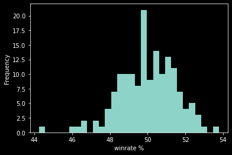

# League of Legends Match Outcome Prediction
This project is being developed as part of the Knowledge Discovery in Databases (ITCS - 6162) course at The University of North Carolina at Charlotte.

## Team Members:
- Tarun Ravada
- Vishwath Kamalanathan
- Swetha Natakala Ramakumar
- Adithi Macherla

## Introduction
League of Legends, commonly referred to as League, is a highly popular Multiplayer online battle arena game by RIOT Games. If this is your first time hearing about League, please visit this [page](https://www.leagueoflegends.com/en-us/how-to-play/) for a quick introduction to the game.

League is currently one of the most played and most viewed games on Twitch, a popular streaming platform. The League of Legends World Championship held annually is one of the largest esports in the world, with a prize pool of more than 2 million USD. The game attracts players and viewers from different regions of the world, with the largest player bases being Europe and North America. 

For a popular game such as League, streamers, professional teams, and team sponsors have high stakes riding on their performance in the game. As such, a lot of time and resources are spent analyzing the game to maximize a teams’ win rate. 

## Project 
### Description
This project aims to develop a machine learning model that can predict which team out of two will win a match of League, given some initial information about the teams. 

Every match of League has many factors that affect the outcome of the match. Some examples of these factors are the playable character (champion) being played, the proficiency of the player with the champion, the role in which the player is playing, the usefulness of the champion in a role, etc. 

This project will consider several of these attributes in conjunction with the team composition of the two teams (the champions that each team consists of) and identify the factors that are most useful in predicting the outcome of a match.

### Data
The initial data source for this project is a large data set consisting of in-game statistics of players playing League at the Master rank level. The dataset was obtained from [Kaggle](https://www.kaggle.com/jasperan/league-of-legends-1v1-matchups-results). Additional game data will be obtained from League servers using the Riot Games [API](https://developer.riotgames.com/docs/lol).

To understand the data attributes we utilized information available through the RIOT developers [documentation](https://developer.riotgames.com/docs/lol#general_game-constants) and our knowledge of the game

More information about the data is provided in the [Data Understanding](#data-understanding) section.

### Installation
- Python version >= 3.8
- Jupyter Notebook 

### Repository Guide
A guide on navigating the repo. To be added.

## CRISP-DM Process:
- [Business Understanding](#business-understanding)
- [Data Understanding](#data-understanding)
- [Data Transformation](#data-transformation)
- [Modeling](#modeling)
- [Evaluation](#evaluation)

### Business Understanding
As outlined in the [Introduction](#introduction), for those with high stakes in League, constantly improving their game win rate is important. Being able to determine the chances of winning a match based on the team composition is very valuable to players, as it will help them choose the best possible champion for each match.

Team composition by itself does not provide enough information to determine the outcome of a match. Several other factors such as a players’ proficiency, a champions’ usefulness, etc., play an important role in the outcome of a match.

This project will consider the following attributes along with team composition, as inputs to the predictive model.
- Win rate of the champion in the role being played
- k/da of the champion in the role being played
- Win rate of the champion in the game
- k/da of the champion in the game

Feature Description
- Win rate is the ratio of games won to total games played
- k/da is the ratio of kill+assists to total deaths

More information about these attributes is provided in the [Data Understanding](#data-preprocessing) section.

#### Success Criteria
To be functional, the predictive model should have an accuracy of at least 50%, as that is the probability of winning a random match of League. [Previous attempts](https://towardsdatascience.com/match-prediction-in-league-of-legends-using-vanilla-deep-neural-network-7cadc6fce7dd) at predicting the outcome of a match of league showed an accuracy of 70%. By using additional unique features this project will attempt to develop a model that can perform with an accuracy higher than 70%.
In addition to developing a predictive model, this project will also study the relationship between different game attributes, and identify the ones that impact the outcome of a game the most.

### Data Understanding
#### Data Collection
The initial dataset ‘matches.csv’ was obtained as described in the [Data](#data) section. The dataset had 14 columns and 1312252 records.

The different columns can be separated into 3 categories:

Match attributes - attributes common to every match
 - GOLDEARNED, TOTALMINIONSKILLED, WIN, KILLS, ASSISTS, DEATHS, CHAMPION, VISIONSCORE, TOTALDAMAGEDEALTTOCHAMPIONS

Unique attributes - attributes unique to every match or the game itself
 - P_MATCH_ID, PUUID, SUMMONERNAME, GAMEVERSION

Irrelevant attributes
 - Unnamed: 13

#### Data preprocessing
The original data ‘matches.csv’ contained irrelevant attributes, missing values, and columns with more than one attribute. The data was cleaned, irrelevant attributes were dropped, and null and invalid records were removed. 

#### Data Exploration
Associated Notebooks
- [EDA](EDA.ipynb)

The dataset was explored to understand its range of values and types of values. This helped determine which additional features can be generated from the data to use as inputs to the model.

Each record in the dataset corresponds to one player in a match. The dataset contains information about multiple players from each match.

After processing the dataset contained 1312248 records and 15 columns
- GOLDEARNED - Gold earned by player in the match
- TOTALMINIONSKILLED - Total minions killed by player in the match
- WIN - Match won or lost. Either True or False
- KILLS - Total kills by player in the match
- ASSISTS - Total assists by player in the match
- DEATHS - Total deaths of player in the match
- CHAMPION - The champion being played
- VISIONSCORE - The vision score of the player in the match
- TOTALDAMAGEDEALTTOCHAMPIONS - Total damage dealt by player to other players
- PUUID - The unique identifier of the player. it is tied to the player's RIOT games account, and is unique through the game, across all regions.
- SUMMONERNAME - The "username" / "gamertag" of the player. It is unique within a region.
- GAMEVERSION - The version of the game a match belongs to.
- REGION - Region (US, EU, etc.) in which the match was played. Only players from a single region can queue together.
- MATCH_ID - Unique identifier for each match in the dataset. Each match must have 10 records
- ROLE - The role the player was playing in the match

##### Correlation

Correlation analysis showed that Kills, Assists, and Gold have a stronger correlation with winning than other factors. 

##### Feature Distribution

Feature value distributions were studied to ensure the data had no irregularity or outliers. All the feature distributions were as expected.

##### Class Distribution

The distribution of the class label was plotted across different features. The plots show that the data is almost equally distributed across each class.

##### Champion Data analysis
Our dataset contains information on all the 156 different champions available in-game as of Patch 11.17
 
Champion Winrate

Champion win rate by role

All champion win rates are within the range of 44 to 54 percent. This is expected since the game is constantly balanced so that all champions have a comparable win rate. 

Champion win rates by role are in the range of 0 - 100 percent. This shows that champion win rates by role can be an important factor in determining the outcome of a match.

### Data Transformation
Status: in progress

Associated notebooks
- [Dataset for Champion k/da by role](preprocessing/champ_role_kda.ipynb)

Each record in the dataset corresponds to one player in a match. The dataset contains information about multiple players from each match. Since the input to the predictive model will be the team compositions of each team along with other attributes, before the modeling stage, the data was grouped and transformed. Additional datasets were created for the new features. 

A sample input to the model would have the following structure
- (team)-(role)-champion, (champion)-(role)-kda, and (champion)-winrate for each of the 10 players in the game. Totaling to 30 input features.

### Modeling
The XGBoost classifier will be used to build a basic model and evaluate how well the algorithm performs on the data. XGBoost is an optimized decision tree classifier and is suited for the data used in this project. Support Vector Machine (SVM) and K-Nearest Neighbors will be considered for alternative baselines on our data. 

Given that the dataset has more than 50K data points, sophisticated classifiers such as MLP or Neural Nets will be considered for the final model.

### Evaluation
The model’s performance will be measured through Accuracy, Precision, Recall, AUC, and ROC curves with emphasis on the Recall metric. The scores will be evaluated on the baselines discussed in [Success Criteria](#success-criteria)
